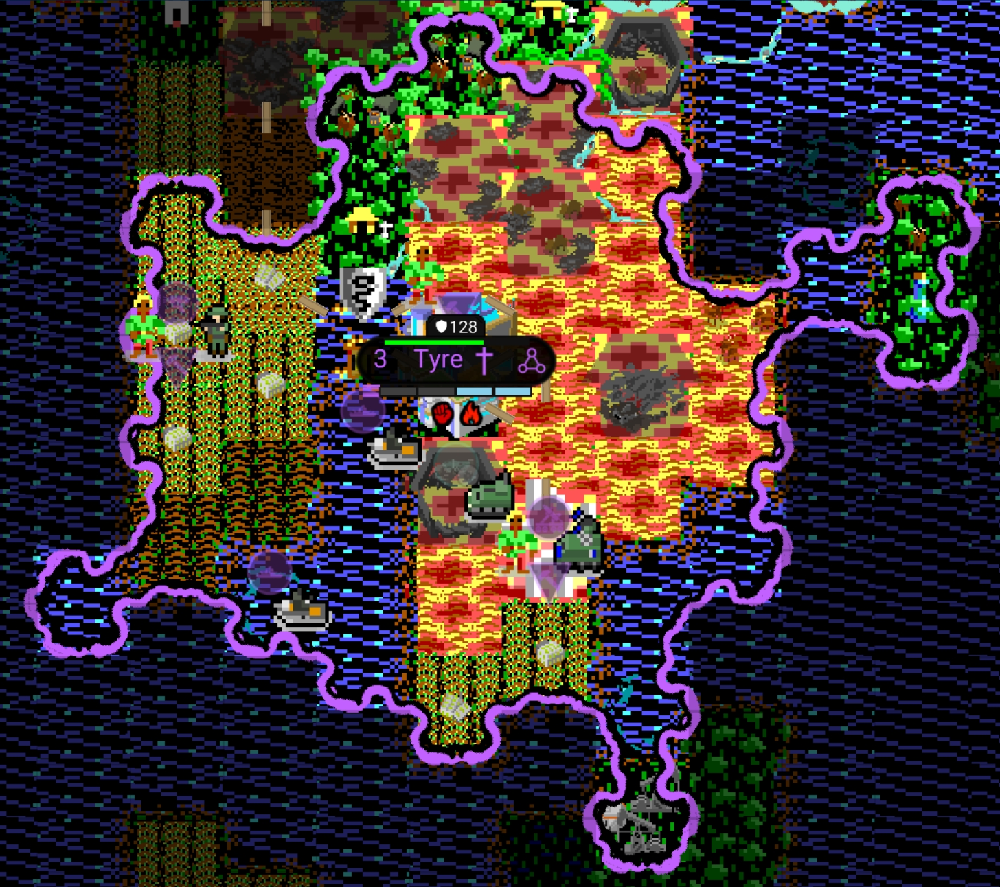
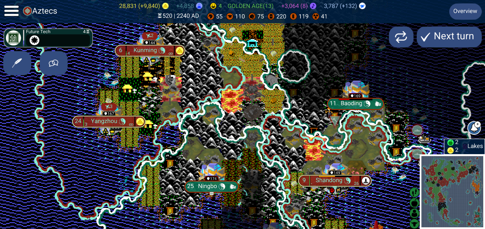
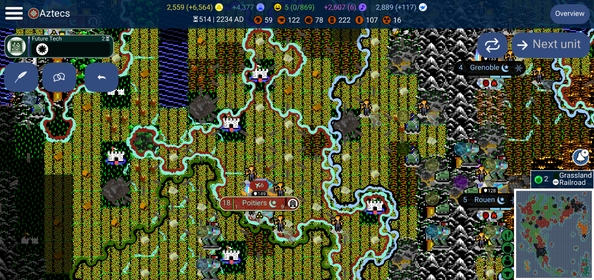
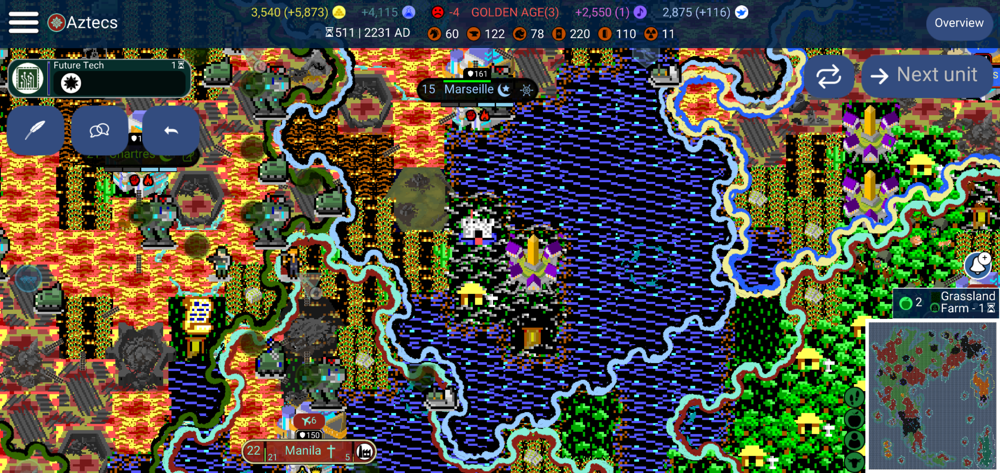

# Ethereal borders
Borders mod, designed for the Ultima V component set. Based on the Shadowlord ethereal realm battlefield screen.

Are you ready for the **abstractness of unclearly defined** borders? Energy fields grow and grind, splitting and recombining in wild patterns!

